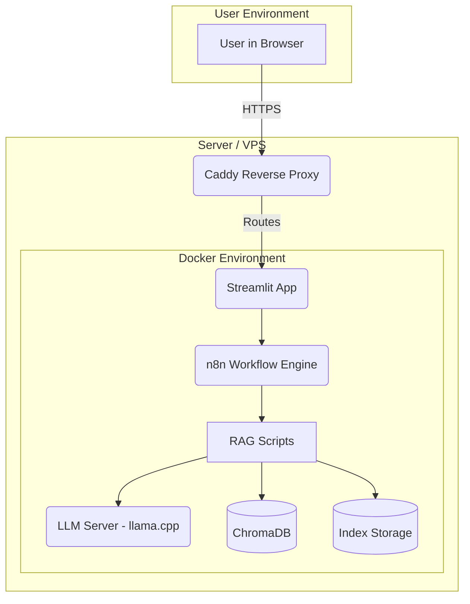

# LexAI Pro: Premium Legal Assistant

LexAI Pro is a production-grade, private RAG (Retrieval-Augmented Generation) assistant designed specifically for legal environments. It allows law firms to securely index their documents and query them using local LLMs, ensuring that sensitive data never leaves the controlled environment.

## 🌟 Key Features

- **LexAI Pro UI**: A modern, professional web dashboard built with Streamlit, featuring a chat-first interface and sidebar knowledge base browser.
- **Advanced RAG Pipeline**: High-precision retrieval using LlamaIndex and ChromaDB with similarity post-processing to minimize hallucinations.
- **Deep Ingestion (Nougat OCR)**: AI-powered OCR support for complex PDFs, including multi-column tables, mathematical formulas, and structured citations.
- **RAG + CAG Hybrid Engine**: Implements Cache-Augmented Generation (CAG) to pre-load relevant context, reducing latency and improving answer accuracy.
- **Source Citations**: Transparent responses with verified citations, showing filenames, relevance scores, and text snippets.
- **Fully Containerized**: Orchestrated with Docker Compose, featuring Caddy reverse proxy, n8n workflow engine, and llama.cpp LLM server.

## 🏗️ Architecture

The system is composed of four main containerized services:



## 🚀 Getting Started

### Prerequisites

- Docker and Docker Compose
- A GGUF model file (e.g., `Phi-4-mini-instruct.Q8_0.gguf`) placed in the `models/` directory.

### Installation & Deployment

1. **Clone the repository**:
   ```bash
   git clone <repository-url>
   cd AI_LawFirmProject
   ```

2. **Prepare the environment**:
   Create a `.env` file with your configuration:
   ```env
   CADDY_SITE_ADDRESS=lexai.yourdomain.com
   MODEL_FILE=Phi-4-mini-instruct.Q8_0.gguf
   N8N_WEBHOOK_URL=http://n8n-app:5678/webhook/<your-webhook-id>
   ```

3. **Launch the services**:
   ```bash
   docker-compose up --build -d
   ```

4. **Initialize Knowledge Base**:
   Upload your legal documents to the `docs/` folder and use the UI to trigger a re-sync.

## 🛠️ Components

- **Streamlit App**: The frontend UI for user interaction.
- **n8n**: Orchestrates the document ingestion and query workflows.
- **llama.cpp**: Serves the local LLM with an OpenAI-compatible API.
- **RAG Scripts**: Python scripts in `rag_scripts/` that handle the heavy lifting of indexing and querying.

## 🔒 Security

- **Local Processing**: All data stays within your Docker network.
- **Non-root Users**: Services are configured to run with limited privileges where possible.
- **Sanitized Inputs**: n8n workflows include base64 encoding and sanitization to prevent command injection and path traversal.

## 📜 License

Private & Confidential - Internal Use Only for Law Firm Environments.
